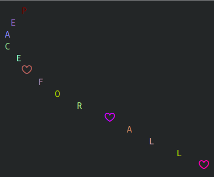

# Repo for analysis of the Uniqlo x Akamai 'Peace for All' tShirt

For details see [the blog post at tris.sherliker.net](https://tris.sherliker.net/blog/obfuscated-self-evaluating-bash-script-by-cdn-akamai-being-supplied-to-consumers-via-retail-stores/). 

The shirt contains a bash script with obfuscated text. Decoded, it outputs a text animation of the message "Peace for all" with heart emojis: 

[▶ Terminal recording (webm)](term-output-recording.webm)
